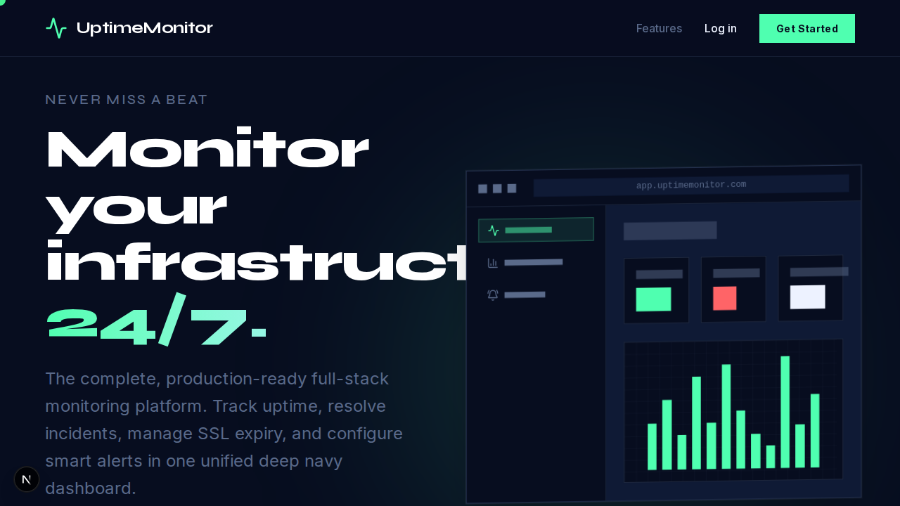

# UptimeMonitor - Full-Stack Next.js Platform



A complete, production-ready full-stack website uptime and incident monitoring platform built entirely on Next.js 15. No separate backend, external cron jobs, or third-party monitoring services required.

## 🚀 Advanced Features & Architecture

### The Monitoring Engine (Zero External Dependencies)
Unlike typical Next.js apps that rely on Vercel Cron or external services to trigger background tasks, **UptimeMonitor** runs its own persistent monitoring engine natively inside Next.js.
*   By leveraging `instrumentation.ts` and the `nodejs` runtime, a globally scoped `setInterval` polls the SQLite database every 10 seconds.
*   **Multi-Protocol**: Supports HTTP(S), PING, and HEARTBEAT (Cron) checks.
*   **SSL Expiry Tracking**: Automatically intercepts HTTPS handshakes to read the underlying `PeerCertificate`, alerting you days before an SSL cert expires.
*   **Smart Retry Logic**: Monitors support configurable retries (e.g., check 3 times before failing) to completely eliminate false positives caused by transient network hiccups.
*   **Keyword Validation**: Parse raw HTTP response bodies to guarantee specific strings are returned (e.g., verifying a database connection string on a health check endpoint).

### Security & Access Control
*   **Role-Based Access Control (RBAC)**: Integrated NextAuth.js v4 with Credentials provider. The first user to register is automatically elevated to `ADMIN`. Subsequent users are `USER`. Next.js Middleware fully protects `/admin` and `/dashboard` routes based on JWT claims.
*   **In-Memory Rate Limiting**: A custom implementation (`src/lib/rateLimit.ts`) accurately reads `x-forwarded-for` / `x-real-ip` headers to prevent brute-force attacks on the Auth API and DDoS attacks on public Heartbeat APIs.
*   **Anti-Mass Assignment**: All `PATCH` and `POST` routes are strictly typed using **Zod** schemas (`src/lib/validations.ts`). The API explicitly drops any unvalidated fields attempting to be written to the Prisma database.

### Incidents, Alerting & Extensibility
*   **Automated Lifecycle**: When a monitor fails (after retries), an `ONGOING` incident is created. When it recovers, the incident is automatically marked `RESOLVED`.
*   **Alert Rules**: Users can configure Webhook and Email alerts (simulated) per monitor.
*   **Maintenance Windows**: Scheduled maintenance windows temporarily suppress downtime alerts and pause pinging, preventing unnecessary panic and noise.
*   **Public Status Pages**: Generate beautiful, public-facing pages (`/status/[slug]`) to transparently communicate system health.
*   **API Key Programmatic Access**: Users can generate secure, cryptographic API keys to authenticate via `Authorization: Bearer <token>` for `GET /api/monitors` and other programmatic endpoints.
*   **Data Export**: Download historical monitor logs (Response Times, Status Codes, Timestamps) in raw `.csv` format.

## 🎨 UI/UX Design Philosophy

The application rejects generic component libraries (like out-of-the-box shadcn/ui) in favor of a highly custom, premium aesthetic.

*   **Theme**: Deep Navy Modern (`#070D1F` Background, `#0F1A35` Surface, `#4FFFB0` Accent).
*   **Typography**: Google Fonts Inter (sans) and Syne (display/headings) via `next/font/google`.
*   **Component Styling**: Absolutely no drop shadows or rounded corners. The UI relies strictly on sharp edges (`rounded-none`), asymmetric grid layouts, and flat borders (`border-[#5A6A8A]/30`) for structure.
*   **Framer Motion**: Extensive use of `framer-motion` for entrance animations, staggered grid load-ins, scroll-linked parallax (on desktop), and micro-interactions (e.g., button scale on tap).
*   **Custom Cursor**: A custom React component tracks mouse movements with a smooth spring physics effect on desktop viewports.

## 🛠️ Local Development

### Prerequisites
*   Node.js 20+
*   npm

### Setup
1.  Install dependencies:
    ```bash
    npm install
    ```
2.  Configure Environment Variables: Create a `.env` file in the root directory:
    ```env
    DATABASE_URL="file:./dev.db"
    NEXTAUTH_SECRET="your_super_secret_key_here"
    NEXTAUTH_URL="http://localhost:3000"
    ```
3.  Sync the Prisma Schema:
    ```bash
    npx prisma db push
    ```
4.  Start the Development Server:
    ```bash
    npm run dev
    ```
    *Note: Next.js HMR (Hot Module Replacement) can sometimes cause issues with the background `setInterval` in development. If you experience duplicate logs, test against a production build.*

### Production Build
```bash
npm run build
npm run start
```
