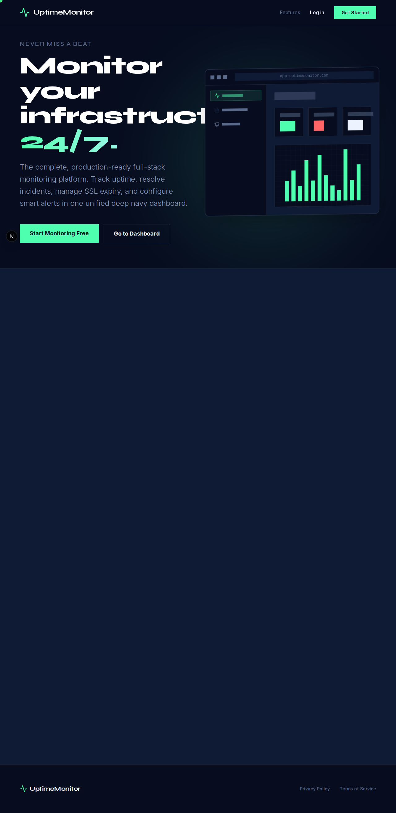

# UptimeMonitor - Advanced Full-Stack Monitoring Platform




## Overview

UptimeMonitor is a production-ready, highly advanced full-stack web platform built entirely on Next.js. It allows users to proactively monitor websites, APIs, and critical infrastructure with real-time observability, intelligent alerting, automated incident tracking, and comprehensive analytics.

No separate backend is required; all logic, database interactions, and automated background polling are handled natively within Next.js through Server Actions, API routes, and experimental instrumentation features.

---

## 🚀 Key Features

### Complete Observability
* **Multi-Protocol Monitoring**: Support for HTTP/HTTPS endpoints, API heartbeat tracking, custom payloads, specific header configurations, and advanced keyword validation logic.
* **Intelligent Polling Strategy**: Continuous, asynchronous background checks configured at custom intervals to ensure absolute accuracy without overloading the target system.
* **SSL & Security Checks**: Automatic extraction and monitoring of HTTPS certificate expiration dates, warning users long before critical security infrastructure fails.

### Smart Alerting & Incident Lifecycle Management
* **Configurable Alert Channels**: Direct integrations for Webhooks, Emails, and more.
* **Granular Threshold Logic**: Set custom timeout constraints, smart retry delays to eliminate false-positives, and downtime threshold requirements before triggering alerts.
* **Automated Incident Tracking**: System automatically initiates incident logs when an outage is detected, tracking total downtime, tracking historical latencies, and self-resolving when service is restored.

### Premium Dashboard & Public Status
* **Deep Navy Modern UI**: World-class visual design relying heavily on `framer-motion` for buttery smooth interactions and a split-pane, ultra-responsive dashboard.
* **Public Status Pages**: Automatically generate and distribute customizable public-facing pages allowing external stakeholders to transparently track system health.
* **Real-time Analytics**: Built-in visual charts rendering latency trends and uptime percentage calculations.

---

## 🛠 Tech Stack

* **Framework**: [Next.js (App Router)](https://nextjs.org/)
* **Language**: TypeScript
* **Database & ORM**: [Prisma v5](https://www.prisma.io/) (Configured dynamically, defaulting to SQLite for rapid bootstrapping)
* **Styling & Animation**: Tailwind CSS, Framer Motion, Lucide React
* **Authentication**: NextAuth.js
* **Charts**: Recharts

---

## ⚙️ Quick Start

### 1. Clone the repository and install dependencies
```bash
git clone https://github.com/your-username/uptime-monitor.git
cd uptime-monitor
npm install
```

### 2. Configure Environment Variables
Create a `.env` file in the root directory and add a secret for authentication:
```env
NEXTAUTH_SECRET="your-super-secret-key-at-least-32-chars"
NEXTAUTH_URL="http://localhost:3000"
```

### 3. Initialize the Database
The project uses Prisma. We've included a script to automate the initial setup. Run:
```bash
npm run prebuild
```
*Note: This script will evaluate your environment, load the schema, generate the Prisma client, and push the initial database tables.*

### 4. Start the Application
To run the background monitoring processes simultaneously with the frontend, you must start the Next.js server locally:
```bash
npm run dev
```

Your platform is now live at `http://localhost:3000`.

---

## 📱 Mobile Responsiveness

The entire interface has undergone a rigorous page-by-page mobile overhaul, ensuring flawless stacking behavior, horizontally scrollable data tables, and fully responsive navigation overlays on small viewports across both user and administrative interfaces.

---

## 🔒 Administration & Security

UptimeMonitor features built-in Role-Based Access Control (RBAC). Admin users have a dedicated isolated portal to:
* Manage global monitor overrides.
* Suspend or manage user accounts.
* Audit global platform changes.

---

## License

This project is licensed under the MIT License.
